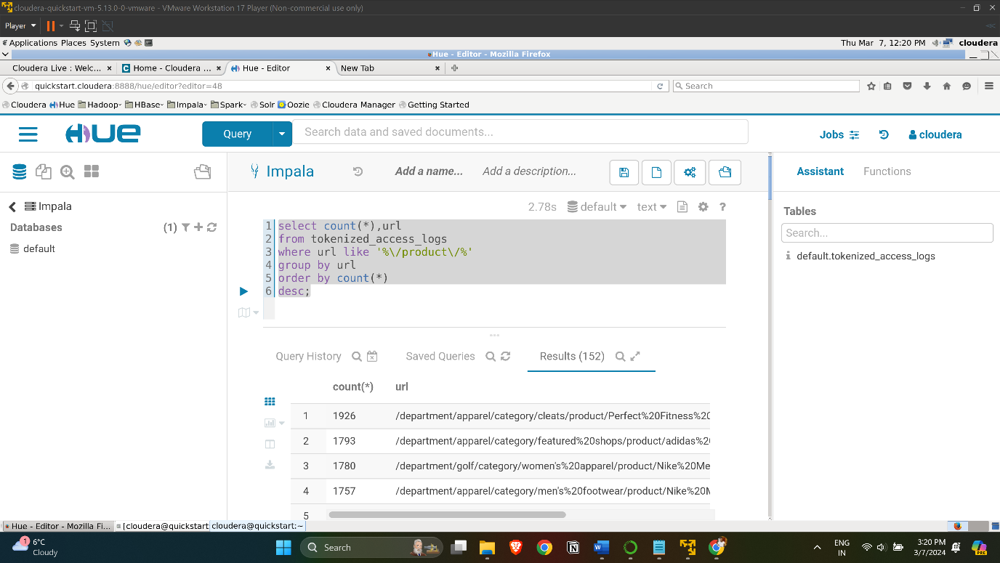

# Big data - Hadoop and Hive exercises on Cloudera environment

# Exercise 1

The sqoop import-all-tables command is used in Apache Sqoop to import
all tables from a relational database into the Hadoop Distributed File
System (HDFS).

Specifies the number of parallel threads to use. In this case, only one
thread is used.

Specifies the JDBC connection string to the MySQL database. It includes
the database host (quickstart), port (3306), and the database name
(retail_db).  

Specifies the username used for connecting to the MySQL database.

Specifies the password used for connecting to the MySQL database.  

Specifies the compression codec to be used for the import. In this case,
it's set to Snappy.

Specifies that the imported data should be stored in Parquet file
format. Parquet is a columnar storage format optimized for use with
Hadoop.  

Specifies the HDFS directory where the imported data will be stored.
This directory is often associated with Hive, a data warehouse system
built on top of Hadoop.

Specifies that after importing data into HDFS, Sqoop should also import
the data into Hive. Hive is a data warehouse infrastructure built on
Hadoop that provides a higher-level SQL-like language (HiveQL) for
querying and analyzing data.  

The above code retreived 1345 records using mapreduce.

Lists the contents of the specified HDFS directory (categories).  

Show the output of 6 items in the HDFS directory

Lists the contents of the warehouse in which categories  

Found 5 items in the categories table

Invalidates the metadata for Hive, causing it to reload metadata from
the Hive Metastore.  

Query result successfull

Displays the list of tables in the current Hive database.

Categories, Customers, departments, order_items, orders, products

The query retrieves data from the "order_items," "products," and
"categories" tables. It performs an inner join between "order_items" and
"products" based on the product IDs. Then, it joins the resulting table
with the "categories" table using the product category IDs. The data is
grouped by category names, and for each category, the quantity of
ordered items is counted. The result is ordered in descending order
based on the item count, and finally, only the top 10 records are
selected for presentation.

Result: 10 records showing highest order by category in a descending
order

The query involves a nested structure. It first calculates the total
revenue for each product by summing the order item subtotals in the
"order_items" table. This is done within a subquery named 'r.' The
subquery also performs an inner join with the "orders" table, linking
order items to their respective orders based on order IDs. It filters
out orders with statuses 'CANCELED' or 'SUSPECTED_FRAUD' and groups the
results by the product IDs.

The outer query selects specific columns (product ID, product name, and
revenue) from the "products" table and joins this information with the
aggregated revenue data from the subquery. The connection is established
based on matching product IDs. The final result is ordered by revenue in
descending order, and only the top 10 records are presented.

Result: top 10 revenue generating products  

# Exercise 2

Again in the terminal, creates a new directory in HDFS for storing
original access logs.  

Copies the local access log file "access.log.2" to the HDFS directory
for original access logs.

Lists the contents of the HDFS directory for original access logs.  

Output- found 1 item

In the Hive query editor:  
This SQL statement is creating an external table in Hive named
"intermediate_access_logs" with a specified schema and properties. The
table is designed to store log data, possibly from web server access
logs. Here's a breakdown:

Table Name: intermediate_access_logs

Column Definitions:

ip, date, method, url, http_version, code1, code2, dash, user_agent are
columns of type STRING, each representing a different aspect of log data
(IP address, date, HTTP method, URL, HTTP version, response codes,
etc.).

Row Format SerDe (Serializer/Deserializer):

The data in the table is expected to be in a specific format, and the
'RegexSerDe' is used to parse the data based on a regular expression.

SerDe Properties:

input.regex: Specifies the regular expression pattern for parsing each
log entry. The pattern captures different components of a log entry,
such as IP address, date, HTTP method, URL, etc.

output.format.string: Specifies the format in which the output should be
presented. It uses placeholders (%1, %2, ..., %9) to represent different
captured components of the log entry.

Location:

Specifies the HDFS directory (/user/hive/warehouse/original_access_logs)
where the external table will be physically stored. This is the location
where Hive will look for the actual data files.  

This set of SQL statements involves the creation of another external
table in Hive named "tokenized_access_logs." Here's a breakdown of the
statements:

Table Definition:

Table Name: tokenized_access_logs

Column Definitions: Same as in the previous table (ip, date, method,
url, http_version, code1, code2, dash, user_agent), indicating it's
structured similarly to the "intermediate_access_logs" table.

Row Format:

ROW FORMAT DELIMITED FIELDS TERMINATED BY ',': Specifies that the data
in this table is delimited by commas (,). This suggests that the log
entries are expected to be in CSV (Comma-Separated Values) format.

Location:

LOCATION '/user/hive/warehouse/tokenized_access_logs': Specifies the
HDFS directory where the external table's data files are stored. This is
where Hive will look for the actual CSV-formatted data files.

Jar Addition:

ADD JAR /usr/lib/hive/lib/hive-contrib.jar; Adds a Java Archive (JAR)
file (hive-contrib.jar) to the Hive environment. This JAR file likely
contains additional Hive functions or contributions that might be used
in subsequent queries.  

This SQL statement performs an insertion of data from one Hive table
(intermediate_access_logs) into another Hive table
(tokenized_access_logs). Here's a breakdown:

INSERT OVERWRITE TABLE tokenized_access_logs:

Initiates the insertion process, overwriting any existing data in the
destination table (tokenized_access_logs).

SELECT \* FROM intermediate_access_logs:

Retrieves all columns (\*) from the source table
(intermediate_access_logs).  

In the Impala query editor:

Invalidates the metadata for Hive, causing it to reload metadata from
the Hive Metastore.

This SQL query is used to analyze the data in the
"tokenized_access_logs" table, focusing on URLs that contain the
substring '/product/'. Here's a breakdown:

SELECT count(\*), url:

Counts the number of occurrences and selects the URL column from the
"tokenized_access_logs" table.

FROM tokenized_access_logs:

Specifies the source table for the query, which is the
"tokenized_access_logs" table.

WHERE url LIKE '%/product/%':

Filters the data to include only rows where the URL column contains the
substring '/product/'. The LIKE keyword is used for pattern matching,
and % represents any sequence of characters.

GROUP BY url:

Groups the results based on unique URLs, aggregating the count for each
unique URL.

ORDER BY count(\*) DESC:

Orders the results in descending order based on the count of
occurrences. This means URLs with a higher count will appear first.

Result:

The above query give the result of 152 records where in the department
of apparel category the product as perfect fitness has 1926 url links in
the tokenized access logs.

# What is the 5th most revenue generating product?

The product that ranks fifth in terms of revenue generation is the Nike
Men’s DRI-FIT Victory Golf Polo, contributing a total revenue of
\$28,330,200.  

# How much revenue does the Nike men's dri-fit polo earn?

As we already achieved the result in the last question but when trying
to find the answer using the LIKE operator there we no result when
searched with the whole name when I search with NIKE I found it to be
the same.

Revenue generated by Nike men's dri-fit polo is \$28330200  

# There is one product that did not show up in the previous result. It seems to be viewed a lot, but never purchased. 

The product named "Perfect Fitness Perfect Rip Deck" holds the
distinction of having the highest number of views, yet intriguingly, it
has not recorded any purchases.

# Conclusion

In conclusion, the conducted lab exercises encompassed a comprehensive
exploration of Apache Sqoop, Hive, and Impala within the context of Big
Data and Data Management. The Sqoop commands were instrumental in
efficiently importing tables from a relational database into HDFS,
emphasizing parallelism, connection details, compression, and storage
formats like Parquet. The subsequent integration with Hive showcased the
seamless transition of data into a data warehousing infrastructure.

The Hive queries demonstrated intricate data analysis and manipulation
capabilities. The exploration of tables like "order_items," "products,"
and "categories" involved complex joins, aggregations, and sorting to
derive meaningful insights such as the top categories based on order
quantities and the highest revenue-generating products. The nested
queries efficiently computed product revenue while excluding specific
order statuses.

Exercise 2 introduced the creation of external tables in Hive, focusing
on log data. The utilization of regular expressions, delimiters, and
SerDe properties illustrated the adaptability of Hive for diverse data
formats. The subsequent insertion and analysis queries emphasized the
seamless data flow and querying capabilities within the Hadoop
ecosystem.

In the Impala environment, metadata invalidation demonstrated
synchronization with Hive's metastore, ensuring up-to-date information
for query processing. The final query unveiled a detailed analysis of
URLs containing '/product/', providing insights into product popularity
within the access logs.

The identification of the 5th most revenue-generating product, Nike
Men’s DRI-FIT Victory Golf Polo, and the examination of revenue for the
Nike men's DRI-FIT Polo validated the consistency of results across
different approaches. The identification of a product with high views
but no purchases, Perfect Fitness Perfect Rip Deck, highlighted the
potential for deeper insights into user behavior.

Overall, these exercises provided a hands-on experience in working with
Big Data tools, showcasing the power and versatility of Apache Sqoop,
Hive, and Impala in managing, processing, and analyzing large-scale
datasets. The acquired skills are crucial in real-world scenarios, where
efficient data management and analytics are essential for informed
decision-making. The references to Cloudera tutorials served as valuable
resources for understanding and implementing these technologies
effectively.

# Reference

*Tutorials \| Cloudera*. (2024, January 30). Cloudera.
<https://www.cloudera.com/services-and-support/tutorials.html>
